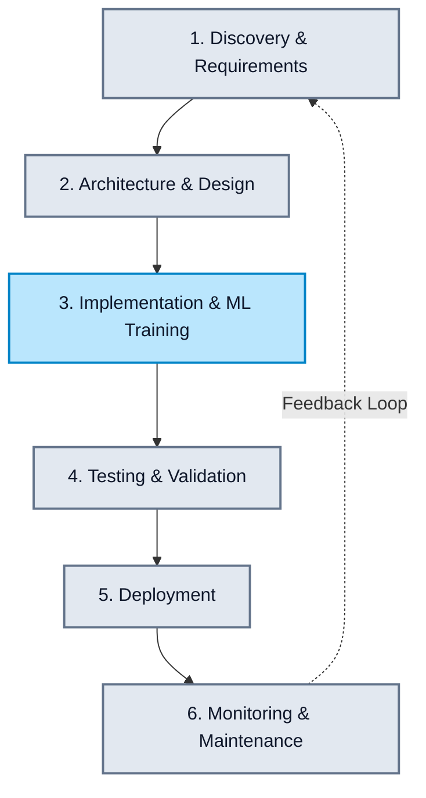

# ClearSky Predictor: Software Development Life Cycle (SDLC)

> [!NOTE]
> **Client Overview Document**
> This document details the engineering methodology and lifecycle stages used to develop the ClearSky Predictor platform. It highlights how we integrated complex Machine Learning pipelines alongside modern web development.

## 🔄 SDLC Methodology: Iterative Agile Framework

For the ClearSky Predictor, we utilize an **Iterative Agile Development Methodology**. This approach allows us to rapidly prototype machine learning models, gather continuous feedback, and incrementally enhance the user interface and AI capabilities without disrupting existing services.

---

## 📅 The 6 Phases of the ClearSky SDLC

### 1. Discovery & Requirements Gathering
*   **Goal:** Define the exact predictive and visual capabilities required by end-users.
*   **Activities:**
    *   Identifying necessary data sources (OpenWeatherMap for pollution metrics, Google Earth Engine for NDVI/vegetation data).
    *   Defining the core AI requirements: Using an LSTM for time-series forecasting and LLaMA-3 for the contextual chatbot.
    *   Establishing performance metrics (e.g., API response times under 500ms, model accuracy KPIs).

### 2. Architecture & System Design
*   **Goal:** Blueprint the decoupled, microservice architecture to isolate heavy ML tasks from web traffic.
*   **Design Outcomes:**
    *   **Frontend Component:** React & Vite for a highly responsive, Glassmorphism-styled UI.
    *   **Orchestration Layer:** Node.js/Express backend to rate-limit, cache, and securely route requests.
    *   **ML Microservice Layer:** Python/FastAPI environment dedicated strictly to data processing, inference, and satellite calculations.

### 3. Implementation & Parallel Execution
*   **Goal:** Execute code development securely and efficiently across two parallel engineering tracks:
    1.  **Software Engineering Track:**
        *   Developing React components (`AssistantPanel`, `AQICard`, `MapOverlay`).
        *   Setting up Express proxy routes and context-based state management (`AQIContext`).
    2.  **Data Science / ML Track:**
        *   Data generation, cleaning, and sanitization (`generate_data.py`).
        *   Training the recurrent LSTM model across varying epochs and validation splits (`train_lstm.py`).
        *   Building the prompt-engineering pipeline for the Conversational AI.

### 4. Testing & Validation (Quality Assurance)
*   **Goal:** Ensure enterprise-grade reliability for both the software and the predictive algorithms.
*   **Activities:**
    *   **Model Validation:** Evaluating the LSTM's predictions using Root Mean Square Error (RMSE) against trailing 7-day historical AQI datasets.
    *   **Integration Testing:** Verifying the Express proxy properly hands off data to the Python FastAPI and formats the responses correctly.
    *   **UI/UX Testing:** Ensuring responsive layouts break cleanly on mobile devices and that Glassmorphism themes dynamically adapt correctly when the AQI thresholds trigger visual changes.

### 5. Deployment & Release Management
*   **Goal:** Deliver the application securely into production environments.
*   **Activities:**
    *   **Secrets Management:** Securely injecting API Keys (Hugging Face, Google Earth Engine) remotely via environment variables.
    *   **Containerization:** Wrapping the Python dependencies, Node server, and compiled React assets into isolated Docker containers to prevent "it works on my machine" issues.
    *   **Gradual Rollout:** Pushing to a staging environment for client review before flipping traffic to the production build.

### 6. Continuous Monitoring & AI Maintenance
*   **Goal:** Ensure the system stays healthy and the AI models remain horizontally accurate over time.
*   **Activities:**
    *   **Model Drift Monitoring:** Tracking the LSTM's efficacy over time. If weather patterns show seasonal shift, the model is queued for re-training with fresh datasets.
    *   **Error Logging:** Tracking API rate limits (e.g., OpenWeatherMap quota checks) and server latency.

---

## 🛡️ Security & Compliance Highlights (For Clients)

To ensure trust, our SDLC strictly enforces:
*   **Strict Boundary Separation:** End-users never communicate directly with our ML models or the database. All requests flow through a secure, rate-limited Node.js routing layer.
*   **State-less AI Interaction:** Prompts sent to the Hugging Face LLaMA endpoint do not track Personally Identifiable Information (PII) beyond the required geographic coordinates to calculate AQI. 

> [!TIP]
> This modern, microservice-based SDLC allows ClearSky to scale its frontend UI globally via CDNs, while dynamically scaling its heavy Python backend resources strictly when ML forecasting demand peaks.
